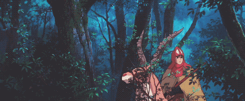

  

# Clayton
Backend Developer

**Languages** &nbsp; JavaScript · Python · Rust &emsp; &emsp; &emsp; **Frameworks** &nbsp; React · Next.js · Express 

working on [canadianformatters.com](https://www.canadianformatters.com/)

---

#### 🌀 [Wyrmhole](https://www.wyrmhole.app/) &nbsp;`v1.0.0`
`Node.js` &nbsp;`WebRTC` &nbsp;`Rust` &nbsp;`magic-wormhole.rs`
> Cross-platform encrypted file transfer. Key based peer-to-peer.

####  [Tuned In](https://chromewebstore.google.com/detail/tuned-in/jfpnhopfpcgkpfjeifjnoimjehhclcem) `v4.0`
`Gemini Nano`
> On-device LLM recommending Spotify tracks matching website mood.

---

  

