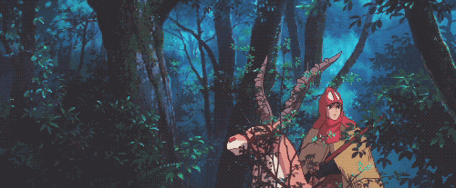

# Clayton
Backend Developer

Working on [Canadian Formatters](https://www.canadianformatters.com/)

## Projects

**[Wyrmhole](https://www.wyrmhole.app/)** · Rust, Node.js, WebRTC
Cross-platform encrypted peer-to-peer file transfer.

**[Tuned In](https://chromewebstore.google.com/detail/tuned-in/jfpnhopfpcgkpfjeifjnoimjehhclcem)** · On-device LLM that recommends music matching a website's mood.

  
  

